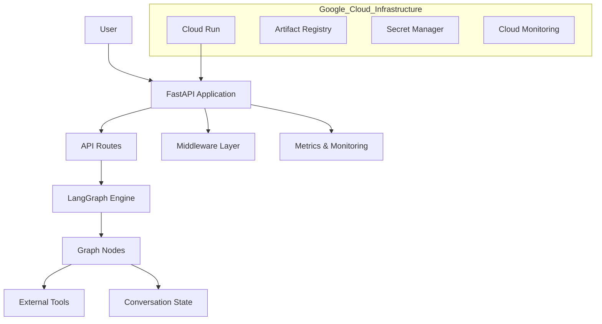

CYNDX Assessment
LangGraph-Based AI Agent API – Serverless Deployment
1️⃣ Project Overview

This project implements a session-based AI Agent API using:

FastAPI for REST API development

LangGraph for stateful agent orchestration

OpenAI (gpt-4o-mini) for LLM responses

Docker for containerization

Google Cloud Run for serverless deployment

The system supports session management, conversation state handling, and scalable cloud deployment.

2️⃣ Key Features

Session-based conversational AI

Stateful message handling per session

LangGraph state graph architecture

Tool-ready design (extensible)

RESTful API endpoints

Dockerized deployment

Serverless hosting via Google Cloud Run

3️⃣ System Architecture
High-Level Flow
Client Request
      ↓
FastAPI Routes
      ↓
Session Manager
      ↓
LangGraph State Graph
      ↓
OpenAI Model (gpt-4o-mini)
      ↓
JSON Response

Architecture Components
Component	Responsibility
FastAPI	HTTP request handling
Sessions Manager	Maintains session state
LangGraph	Agent workflow orchestration
OpenAI	Generates AI responses
Docker	Containerization
Cloud Run	Serverless execution
4️⃣ Project Structure
cyndx-assessment/
│
├── cyndx_langgraph_api/
│   ├── app/
│   │   ├── graph.py
│   │   ├── nodes.py
│   │   ├── routes.py
│   │   ├── state.py
│   │   ├── tools.py
│   │
│   ├── core/
│   │   ├── errors.py
│   │
│   ├── main.py
│
├── Dockerfile
├── requirements.txt
├── .env (excluded from Git)
├── README.md

5️⃣ Local Execution Steps
Step 1: Clone Repository
git clone https://github.com/Anusha1143/cyndx-assessment.git
cd cyndx-assessment

Step 2: Create Virtual Environment
Windows
python -m venv venv
venv\Scripts\activate

Mac/Linux
python3 -m venv venv
source venv/bin/activate

Step 3: Install Dependencies
pip install -r requirements.txt

Step 4: Configure Environment Variables

Create a .env file in project root:

OPENAI_API_KEY=your_openai_api_key_here

⚠️ Important: This file must not be committed to GitHub.

Step 5: Run Application Locally
uvicorn cyndx_langgraph_api.main:app --reload

Application runs at:

http://127.0.0.1:8000

6️⃣ API Endpoints & Testing
6.1 Health Check
Endpoint
GET /

Test (Curl)
curl http://127.0.0.1:8000/

Expected Response
{
  "message": "LangGraph Agent API is running"
}

6.2 Create Session
Endpoint
POST /sessions

PowerShell Test
Invoke-RestMethod `
  -Uri "http://127.0.0.1:8000/sessions" `
  -Method POST `
  -ContentType "application/json" `
  -Body "{}"

Sample Response
{
  "session_id": "sess_462504f7639c",
  "status": "active",
  "agent_config": {
    "model": "gpt-4o-mini",
    "temperature": 0.7
  }
}

6.3 Send Message to Session
Endpoint
POST /sessions/{session_id}/messages

Example
Invoke-RestMethod `
  -Uri "http://127.0.0.1:8000/sessions/sess_462504f7639c/messages" `
  -Method POST `
  -ContentType "application/json" `
  -Body '{"content":"Hello AI"}'

Sample Response
{
  "message_id": "msg_9f8b19ea4ce8",
  "session_id": "sess_462504f7639c",
  "role": "assistant",
  "content": "Hello! How can I assist you today?"
}

7️⃣ Docker Execution
Build Docker Image
docker build -t langgraph-api .

Run Container
docker run -p 8080:8080 -e OPENAI_API_KEY=your_openai_api_key langgraph-api

8️⃣ Google Cloud Run Deployment
Build & Push Image
gcloud builds submit --tag gcr.io/YOUR_PROJECT_ID/langgraph-api

Deploy
gcloud run deploy langgraph-api \
  --image gcr.io/YOUR_PROJECT_ID/langgraph-api \
  --platform managed \
  --region us-central1 \
  --allow-unauthenticated

After deployment, the service will be accessible via a public HTTPS endpoint.

9️⃣ Error Handling
Status Code	Description
422	Missing or invalid request body
404	Session not found
500	Internal server error
🔟 Security Considerations

API key stored via environment variables

.env excluded using .gitignore

No secrets committed to repository

Stateless cloud deployment

1️⃣1️⃣ Validation Checklist

✔ Application runs locally
✔ Session creation successful
✔ Message endpoint returns AI response
✔ Docker build successful
✔ Cloud Run deployment successful
✔ Public endpoint accessible
✔ Clean Git repository (no secrets)

1️⃣2️⃣ Conclusion

This implementation demonstrates:

Stateful AI agent architecture using LangGraph

REST API development with FastAPI

Session-based conversational design

Containerized microservice architecture

Serverless deployment on Google Cloud Run

The project follows production-ready practices including modular design, environment-based configuration, and secure API key handling.

