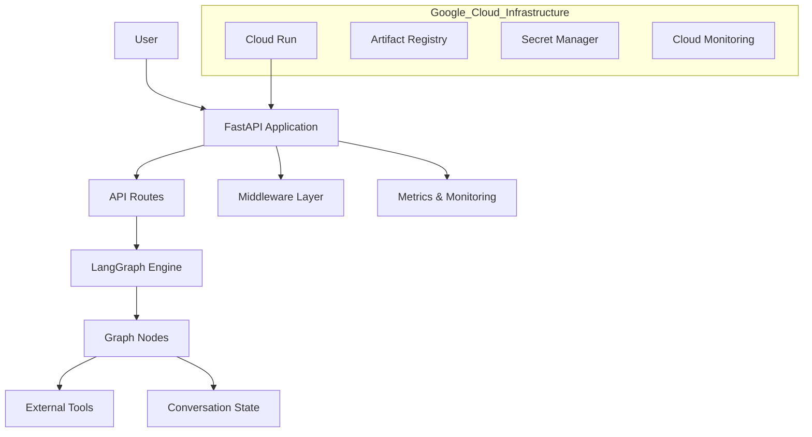

**# Cyndx Assessment – LangGraph-Based AI Agent API– Serverless Deployment**

### 🧠 Project Overview
This project implements a session-based AI Agent API using:

*FastAPI — REST API development

*LangGraph — Stateful agent orchestration

*OpenAI (gpt-4o-mini) — LLM response generation

*Docker — Containerization

*Google Cloud Run — Serverless deployment

**The system supports:**

🔹 Session management

🔹 Conversation state handling

🔹 Scalable cloud deployment

### ✨ Key Features
✔ Session-based conversational AI

✔ Stateful message handling per session

✔ LangGraph state graph architecture

✔ Extensible tool-ready design

✔ RESTful API endpoints

✔ Dockerized deployment

✔ Serverless hosting

### 🏗 System Architecture

**🔄 High-Level Flow****

Client Request

    │
    ▼
    
FastAPI Routes

    │
    ▼
    
Session Manager

    │
    ▼
    
LangGraph State Graph

    │
    ▼
    
OpenAI Model (gpt-4o-mini

    │
    ▼
    
JSON Response

**🧩 Architecture Components**

| **Component**    | **Responsibility**           |
| ---------------- | ---------------------------- |
| FastAPI          | HTTP request handling        |
| Sessions Manager | Maintains session state      |
| LangGraph        | Agent workflow orchestration |
| OpenAI           | Generates AI responses       |
| Docker           | Containerization             |
| Cloud Run        | Serverless execution         |

### 📂 Project Structure
cyndx-assessment/
│
├── cyndx_langgraph_api/
│   │
│   ├── app/
│   │   ├── graph.py
│   │   ├── nodes.py
│   │   ├── routes.py
│   │   ├── state.py
│   │   ├── tools.py
│   │
│   ├── core/
│   │   ├── errors.py
│   │
│   ├── main.py
│
├── Dockerfile
├── requirements.txt
├── .env              (excluded from Git)
├── README.md

### ⚙ Local Execution Steps
**🥇 Step 1: Clone Repository**

git clone https://github.com/Anusha1143/cyndx-assessment.git

cd cyndx-assessment

**🥈 Step 2: Create Virtual Environment**

python -m venv venv

venv\Scripts\activate

**🥉 Step 3: Install Dependencies**

pip install -r requirements.txt

**🔐 Step 4: Configure Environment Variables**

OPENAI_API_KEY=my api key

**▶ Step 5: Run Application Locally**

uvicorn cyndx_langgraph_api.main:app --reload

Application runs at:

http://127.0.0.1:8000

### 🌐 API Endpoints & Testing
**🩺 6.1 Health Check**

**Endpoint**

GET /

**Test**

curl http://127.0.0.1:8000/

**Response**
{
  "message": "LangGraph Agent API is running"
}

**🆕 6.2 Create Session**

**Endpoint**

POST /sessions

**PowerShell Test**

Invoke-RestMethod `

  -Uri "http://127.0.0.1:8000/sessions" 
  `
  -Method POST `
  
  -ContentType "application/json" `
  
  -Body "{}"

**💬 6.3 Send Message**

**Endpoint**

POST /sessions/{session_id}/messages

**Example**

Invoke-RestMethod 

`
  -Uri "http://127.0.0.1:8000/sessions/sess_462504f7639c/messages" `

  
  -Method POST `

  -ContentType "application/json" `

  
  -Body '{"content":"Hello AI"}'

  

### 🐳 Docker Execution

**🔨 Build Image**

docker build -t langgraph-api .

**▶ Run Container**

docker run -p 8080:8080 -e OPENAI_API_KEY=your_openai_api_key langgraph-api

### ☁ Google Cloud Run Deployment

**🚀 Build & Push**

gcloud builds submit --tag gcr.io/YOUR_PROJECT_ID/langgraph-api

**🚀 Deploy**

gcloud run deploy langgraph-api \

  --image gcr.io/YOUR_PROJECT_ID/langgraph-api \

  
  --platform managed \

  --region us-central1 \

  
  --allow-unauthenticated

### ⚠ Error Handling

| **Status Code** | **Description**         |
| --------------- | ----------------------- |
| 422             | Missing/invalid request |
| 404             | Session not found       |
| 500             | Internal server error   |

### 🔐 Security Considerations

*Environment variable based API key storage

*.env excluded via .gitignore

*No secrets committed

*Cloud-native stateless design

### ✅ Validation Checklist
✔ Application runs locally
✔ Session creation works
✔ Message endpoint returns AI response
✔ Docker build successful
✔ Cloud Run deployment successful
✔ Clean repository

### 🎯 Conclusion
🧠 Stateful AI agent architecture using LangGraph

🌐 REST API development with FastAPI

🐳 Containerized microservice design

☁ Serverless deployment using Google Cloud Run

🔐 Secure configuration management

### ✅ Final Step

git add README.md

git commit -m "Enhanced README styling and formatting"

git push origin main

