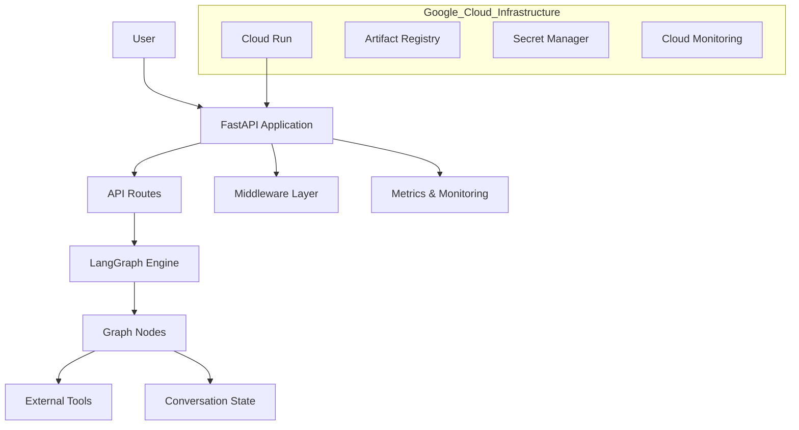

```mermaid
flowchart TD

    User[User] --> FastAPI[FastAPI Application]

    FastAPI --> Routes[API Routes]
    Routes --> LangGraph[LangGraph Engine]
    LangGraph --> Nodes[Graph Nodes]
    Nodes --> Tools[External Tools]
    Nodes --> State[Conversation State]

    FastAPI --> Middleware[Middleware Layer]
    FastAPI --> Metrics[Metrics & Monitoring]

    subgraph Google_Cloud_Infrastructure
        direction TB
        CloudRun[Cloud Run]
        ArtifactRegistry[Artifact Registry]
        SecretManager[Secret Manager]
        CloudMonitoring[Cloud Monitoring]
    end

    CloudRun --> FastAPI
```
